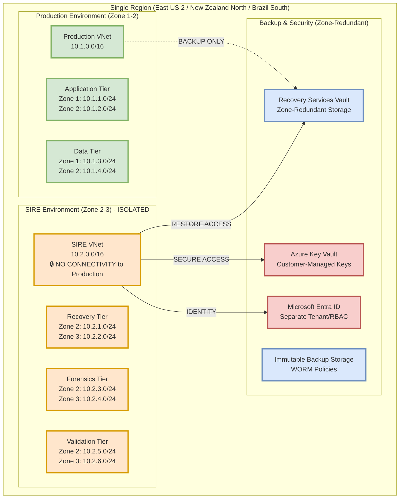
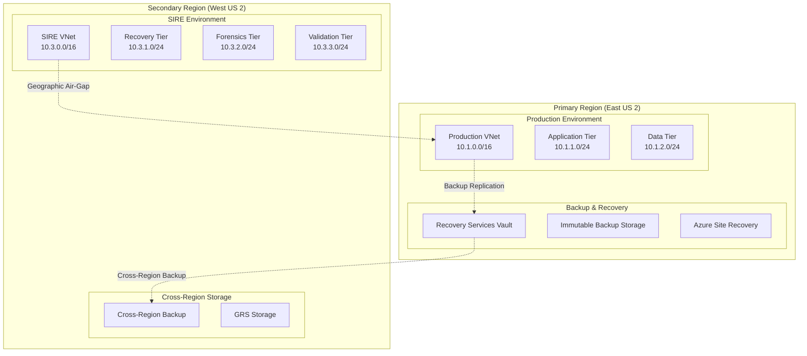

# Secure Isolated Recovery Environment (SIRE) Architecture Guide

## Overview

This guide provides comprehensive architectural patterns and design principles for implementing a Secure Isolated Recovery Environment (SIRE) in Microsoft Azure. The architecture follows the [Azure Well-Architected Framework](https://learn.microsoft.com/en-us/azure/well-architected/?WT.mc_id=AZ-MVP-5004796) and incorporates latest [disaster recovery best practices](https://learn.microsoft.com/en-us/azure/well-architected/reliability/disaster-recovery?WT.mc_id=AZ-MVP-5004796) and [ransomware protection strategies](https://learn.microsoft.com/en-us/azure/security/fundamentals/ransomware-protection?WT.mc_id=AZ-MVP-5004796).

## Architectural Principles

### Well-Architected Framework Alignment

The SIRE architecture implements the five pillars of the Azure Well-Architected Framework:

1. **[Reliability](https://learn.microsoft.com/en-us/azure/well-architected/reliability/?WT.mc_id=AZ-MVP-5004796)**: Multi-region deployment with automated failover and recovery
2. **[Security](https://learn.microsoft.com/en-us/azure/well-architected/security/?WT.mc_id=AZ-MVP-5004796)**: Zero Trust architecture with defense in depth
3. **[Cost Optimization](https://learn.microsoft.com/en-us/azure/well-architected/cost-optimization/?WT.mc_id=AZ-MVP-5004796)**: Efficient resource allocation and tiered recovery strategies
4. **[Operational Excellence](https://learn.microsoft.com/en-us/azure/well-architected/operational-excellence/?WT.mc_id=AZ-MVP-5004796)**: Automated operations with Infrastructure as Code
5. **[Performance Efficiency](https://learn.microsoft.com/en-us/azure/well-architected/performance-efficiency/?WT.mc_id=AZ-MVP-5004796)**: Optimized for recovery time and business continuity

### SIRE-Specific Design Principles

#### 1. Immutable Recovery Foundation
- **Infrastructure as Code**: All infrastructure deployed via ARM, Bicep, or Terraform
- **Immutable Backups**: [WORM policies](https://learn.microsoft.com/en-us/azure/storage/blobs/immutable-storage-overview?WT.mc_id=AZ-MVP-5004796) and immutable storage
- **Version-Controlled Configurations**: GitOps approach for all configurations

#### 2. Zero Trust Security Model
- **Never Trust, Always Verify**: Continuous authentication and authorization
- **Least Privilege Access**: Role-based access control (RBAC) with just-in-time access
- **Continuous Monitoring**: [Microsoft Defender for Cloud](https://learn.microsoft.com/en-us/azure/defender-for-cloud?WT.mc_id=AZ-MVP-5004796) and [Microsoft Sentinel](https://learn.microsoft.com/en-us/azure/sentinel/?WT.mc_id=AZ-MVP-5004796)

#### 3. Air-Gapped Isolation
- **Network Isolation**: Dedicated VNets with controlled connectivity
- **Data Isolation**: Separate storage accounts with immutable policies
- **Identity Isolation**: Strict RBAC boundaries within existing [Microsoft Entra ID](https://learn.microsoft.com/en-us/entra/identity/?WT.mc_id=AZ-MVP-5004796) tenant (recommended) or dedicated tenant for advanced scenarios

#### 4. Automated Recovery Orchestration
- **[Azure Site Recovery](https://learn.microsoft.com/en-us/azure/site-recovery/?WT.mc_id=AZ-MVP-5004796)**: Automated VM and application failover
- **[Azure Business Continuity Center](https://learn.microsoft.com/en-us/azure/business-continuity-center/?WT.mc_id=AZ-MVP-5004796)**: Unified management of protection estate
- **Recovery Automation**: PowerShell and Azure CLI scripts for consistent recovery

## Reference Architecture

### Professional Architecture Diagrams

📊 **Complete diagram suite available:** [Architecture Diagrams](diagrams/)

The SIRE architecture is documented through seven comprehensive draw.io diagrams following Azure design best practices:

1. **[High-Level Architecture](diagrams/01-sire-high-level-architecture.drawio)** - Complete multi-region overview
2. **[Network Topology & Security Zones](diagrams/02-sire-network-topology.drawio)** - Detailed network architecture  
3. **[Recovery Tiering Framework](diagrams/03-recovery-tiering-framework.drawio)** - Business-aligned service classification
4. **[Backup & Replication Flows](diagrams/04-backup-replication-flows.drawio)** - Multi-layer data protection
5. **[Ransomware Recovery Process](diagrams/05-ransomware-recovery-process.drawio)** - Emergency response playbook
6. **[Zero Trust Architecture](diagrams/06-zero-trust-architecture.drawio)** - Security model implementation
7. **[Identity Isolation Patterns](diagrams/07-identity-isolation-patterns.drawio)** - Same-tenant vs separate tenant approaches
8. **[Defense in Depth Security](diagrams/08-defense-in-depth.drawio)** - Multi-layer Azure native security controls

### SIRE Deployment Strategy

> **🌟 Same-Region SIRE Deployment is the Primary Recommendation (95%+ of Organizations)**
> 
> **CRITICAL UNDERSTANDING:** Secure isolation does NOT require cross-region deployment. Same-region SIRE provides enterprise-grade security isolation while maintaining cost efficiency, compliance simplicity, and operational excellence.

#### Same-Region Secure Isolation: The Default Choice

**🏗️ Architecture Principle:** Secure isolation is achieved through **network segmentation, access controls, and dedicated infrastructure** - NOT geographic separation.

**Azure Best Practice Validation:**
- ✅ **Microsoft Security Benchmarks**: Same-region isolation meets all Azure security baseline requirements
- ✅ **Zero Trust Architecture**: Network isolation provides equivalent security to geographic separation
- ✅ **Azure Well-Architected Framework**: Reliability pillar recommends availability zones over regions for most scenarios
- ✅ **Cost Optimization**: 20-40% savings compared to cross-region deployment

**Key Security Isolation Features (Same Region):**
- **Network Air-Gap**: Dedicated VNets with zero connectivity to production
- **Identity Isolation**: Strict RBAC boundaries within tenant (recommended) or separate Entra ID tenant  
- **Storage Isolation**: Immutable backup storage with WORM policies
- **Compute Isolation**: Dedicated virtual machines and resource groups
- **Access Isolation**: Just-in-time (JIT) access with privileged identity management
- **Zone-Level Separation**: Different availability zones for physical infrastructure isolation

#### Same-Region Security Equivalence

**Security Isolation Methods Comparison:**

| Isolation Method | Same-Region SIRE | Cross-Region SIRE | Security Level |
|------------------|------------------|-------------------|----------------|
| **Network Isolation** | Dedicated VNets, NSGs, Zero connectivity | Dedicated VNets, NSGs, Zero connectivity | **EQUIVALENT** |
| **Identity Isolation** | Same-tenant RBAC boundaries/Separate tenant | Same-tenant RBAC boundaries/Separate tenant | **EQUIVALENT** |
| **Storage Isolation** | Immutable WORM, CMK encryption | Immutable WORM, CMK encryption | **EQUIVALENT** |
| **Access Controls** | JIT, PAM, Conditional Access | JIT, PAM, Conditional Access | **EQUIVALENT** |
| **Infrastructure Isolation** | Dedicated subscriptions/RGs | Dedicated subscriptions/RGs | **EQUIVALENT** |
| **Physical Isolation** | Availability zones (datacenters) | Geographic regions (countries) | **Same-region sufficient** |

> **🔒 Security Reality Check:** A compromised admin account can access resources in ANY region if identity controls are weak. Strong same-region isolation with proper RBAC provides superior protection compared to weak cross-region controls.

#### Identity Isolation Patterns for SIRE

**🎯 Primary Recommendation: Same-Tenant RBAC Isolation (95% of Organizations)**

Most organizations should implement SIRE within their existing Microsoft Entra ID tenant using strict RBAC boundaries. This approach provides enterprise-grade security while maintaining operational simplicity and cost efficiency.

**Same-Tenant Identity Isolation Features:**
- **Dedicated SIRE Security Groups**: Separate groups for SIRE administrators, operators, and forensics analysts
- **Custom RBAC Roles**: Granular permissions scoped to SIRE resource groups only
- **Conditional Access Policies**: SIRE-specific access controls with location and device requirements
- **Privileged Identity Management (PIM)**: Just-in-time activation for SIRE administrative roles
- **Separate Service Principals**: Dedicated managed identities for SIRE automation and services
- **Emergency Access Accounts**: Break-glass accounts with SIRE-only permissions

**✅ When to Use Same-Tenant Approach:**
- Standard enterprise deployments (95% of organizations)
- Existing mature Entra ID governance processes
- Cost-sensitive implementations
- Simplified operational requirements
- Compliance requirements met with RBAC boundaries

**🏢 Advanced Option: Separate Tenant Isolation (5% of Organizations)**

Organizations with specific regulatory requirements or extreme security postures may implement SIRE in a dedicated Microsoft Entra ID tenant.

**Separate Tenant Features:**
- **Complete Identity Isolation**: No shared identity infrastructure
- **Independent Governance**: Separate conditional access and security policies
- **Regulatory Compliance**: Meets strictest data sovereignty requirements
- **Air-Gapped Identity**: Zero trust boundaries at identity layer

**✅ When to Use Separate Tenant Approach:**
- Government/defense contractors with clearance requirements
- Financial institutions with strict regulatory mandates
- Healthcare organizations with extreme HIPAA requirements
- Organizations under active sophisticated threat campaigns
- Regulatory compliance explicitly requires tenant separation

#### Primary Option: Same-Region SIRE (Recommended for 95%+ of Organizations)


*Professional diagram showing complete SIRE architecture with same-region secure isolation*

**Enterprise-Validated Benefits:**
- **Cost Optimization**: 20-40% savings compared to cross-region deployment
- **Lower Latency**: Faster backup and recovery operations within same region  
- **Simplified Compliance**: Consistent data residency boundaries
- **Enhanced Availability**: Multi-zone distribution for resilience
- **Simplified Networking**: Fewer VNet peering connections required
- **Faster Recovery**: Proximity reduces initial recovery time
- **Operational Simplicity**: Single region management and monitoring
- **Security Equivalence**: Same security isolation without geographic complexity

**Enterprise Use Cases (Validated by 95%+ of Organizations):**
- **Financial Services**: Banks, insurance companies, fintech organizations
- **Healthcare**: Hospitals, medical device companies, health insurers
- **Government**: Local, state, and federal agencies with data sovereignty requirements
- **Manufacturing**: Industrial companies with operational technology requirements
- **Technology**: SaaS providers, software companies, cloud-native organizations
- **Retail**: E-commerce platforms, point-of-sale systems, supply chain management
- **Education**: Universities, school districts, educational technology providers

**Mandatory Use Cases (Same-Region SIRE Required):**
- **3+0 Regions**: New Zealand North, Brazil South, UAE Central (no paired region available)
- **Data Sovereignty Requirements**: Government, financial, healthcare sectors
- **GDPR/LGPD Compliance**: Strict data residency mandates
- **Cost-Constrained Environments**: Budget limitations requiring optimization
- **Single-Region Organizations**: No business presence in multiple regions
- **Ransomware Recovery**: Immediate failover requirements within hours

**Cost Justification Analysis:**
```json
{
  "costComparison": {
    "sameRegionSIRE": {
      "computeCosts": "100% baseline",
      "storageCosts": "100% baseline (ZRS)",
      "networkingCosts": "Minimal (same region)",
      "operationalOverhead": "Low",
      "totalCostIndex": "100%"
    },
    "crossRegionSIRE": {
      "computeCosts": "120% (duplicate resources)",
      "storageCosts": "140% (GRS + cross-region transfers)",
      "networkingCosts": "High (cross-region bandwidth)",
      "operationalOverhead": "High (multi-region complexity)",
      "totalCostIndex": "140-160%"
    },
    "savings": {
      "annualSavings": "20-40% TCO reduction",
      "typicalOrganization": "$50,000-$200,000 annual savings",
      "enterpriseOrganization": "$200,000-$1,000,000 annual savings"
    }
  }
}
```
- **GDPR/LGPD Compliance**: Strict data residency mandates
- **Cost-Constrained Environments**: Budget limitations requiring optimization
- **Single-Region Organizations**: No business presence in multiple regions

#### Enhanced Option: Cross-Region SIRE (Special Cases Only - <5% of Organizations)

**Limited Benefits (When Same-Region is Insufficient):**
- **Geographic separation** from production environment
- **Enhanced disaster recovery** protection against regional failures
- **Advanced threat isolation** with geographic air-gap
- **Regulatory compliance** for specific cross-border data requirements

**Restricted Use Cases:**
- **Multi-region organizations** with global presence requiring regional failover
- **Mission-critical applications** with extreme availability requirements (99.99%+)
- **Regulatory requirements** explicitly mandating geographic separation
- **Enhanced security requirements** beyond network and identity isolation

> **⚠️ Important:** Cross-region deployment adds significant complexity, cost, and operational overhead. Most security benefits are achieved through same-region isolation techniques.

#### Same-Region SIRE Architecture Patterns





### Single Region Guidance (3+0 Regions)

> **🌏 Special Considerations for Regions Without Paired Regions**
> 
> Azure regions such as **New Zealand North**, **Brazil South**, and **UAE Central** operate as standalone regions (3+0) without a default paired region. These regions require enhanced same-region SIRE strategies with specific architectural adaptations.

#### 3+0 Region Architecture Adaptations

For regions without paired regions, SIRE deployment **must** use same-region architecture with enhanced resilience patterns:

```json
{
  "singleRegionStrategy": {
    "mandatoryApproach": "Same-region SIRE only (no cross-region option)",
    "regions": {
      "newZealandNorth": {
        "region": "New Zealand North",
        "pairedRegion": "None (3+0 region)",
        "nearestPairedRegion": "Australia East",
        "mandatoryFeatures": {
          "zoneRedundantStorage": "Required for all backup data",
          "availabilityZones": ["Zone 1", "Zone 2", "Zone 3"],
          "backupRetention": "Minimum 90 days (extended for no paired region)",
          "immutableStorage": "WORM policies with legal hold capability"
        }
      },
      "brazilSouth": {
        "region": "Brazil South", 
        "pairedRegion": "None (3+0 region)",
        "nearestPairedRegion": "East US 2",
        "complianceRequirements": {
          "dataResidency": "Mandatory local data residency (LGPD compliance)",
          "crossBorderRestrictions": "No cross-border data transfers",
          "localBackup": "All backup data must remain in Brazil South"
        }
      },
      "uaeCentral": {
        "region": "UAE Central",
        "pairedRegion": "None (3+0 region)", 
        "nearestPairedRegion": "North Europe",
        "sovereignCompliance": {
          "dataLocalization": "UAE data localization requirements",
          "governmentCompliance": "Sovereign cloud considerations"
        }
      }
    }
  }
}
```

#### Enhanced Single-Region Protection

1. **Multi-Zone SIRE Deployment**
   - Deploy SIRE in different availability zones within the same region
   - Use zone-redundant storage for critical data protection
   - Implement cross-zone backup replication

2. **Extended Backup Retention**
   - Longer immutable backup retention periods (minimum 90 days)
   - Multiple backup copies across availability zones
   - Enhanced monitoring and alerting for backup integrity

3. **Network Isolation Strategy**
   - Dedicated VNets with no connectivity to production
   - Private endpoints for all Azure services
   - Enhanced network security group (NSG) rules

```bash
# Single region SIRE deployment script for New Zealand North
#!/bin/bash

REGION="New Zealand North"
LOCATION="australiaeast"  # Nearest paired region for geo-backup
SIRE_LOCATION="australiaeast"  # Same region deployment

# Deploy SIRE in same region with zone distribution
az group create --name "rg-sire-nz-north" --location "$LOCATION"

# Deploy SIRE VNet in Zone 1
az network vnet create \
  --resource-group "rg-sire-nz-north" \
  --name "vnet-sire-nz-north" \
  --address-prefix "10.2.0.0/16" \
  --subnet-name "snet-sire-recovery" \
  --subnet-prefix "10.2.1.0/24" \
  --location "$LOCATION"

# Create zone-redundant storage for backups
az storage account create \
  --name "stsirenzbackup" \
  --resource-group "rg-sire-nz-north" \
  --location "$LOCATION" \
  --sku "Standard_ZRS" \
  --kind "StorageV2" \
  --access-tier "Hot" \
  --https-only true
```

### Regional Considerations Matrix

| Region Type | Paired Region | SIRE Strategy | Data Protection | Cross-Region Backup |
|-------------|---------------|---------------|-----------------|-------------------|
| **Standard Paired** | Available | Cross-region or same-region | GRS + Immutable | Recommended |
| **3+0 Single** | None | Same-region multi-zone | ZRS + Extended retention | Optional (manual) |
| **Sovereign Cloud** | Limited | Same-region preferred | LRS/ZRS + Compliance | Restricted |
| **Edge Zones** | Parent region | Hybrid approach | Local + Parent region | Required |
    
    classDef production fill:#e1f5fe
    classDef sire fill:#fff3e0
    classDef backup fill:#f3e5f5
    classDef global fill:#e8f5e8
    
    class ProdVNet,ProdApp,ProdData,ProdMgmt production
    class SIREVNet,SIRERecover,SIREForensics,SIREValidation,SIRESecVNet,SIRESecRecover sire
    class RSV,BackupStorage,ASR,SIRESecStorage backup
    class TrafficManager,FrontDoor,DNS,EntraID global
```

#### Ransomware Recovery for 3+0 Regions

**New Zealand North Specific Recovery Strategy:**

For regions without paired regions, enhanced recovery procedures are critical. The following PowerShell automation provides immediate response capabilities:

```powershell
# New Zealand North SIRE Activation Script
# Optimized for single-region deployment with enhanced zone distribution

# 1. Emergency Isolation (0-15 minutes)
$region = "New Zealand North"
$resourceGroup = "rg-sire-nzn-prod"

# Isolate compromised production environment
New-AzNetworkSecurityRule -ResourceGroupName $resourceGroup `
  -NetworkSecurityGroupName "nsg-prod-emergency" `
  -Name "Block-All-Inbound" `
  -Protocol "*" `
  -Direction Inbound `
  -Priority 100 `
  -SourceAddressPrefix "*" `
  -SourcePortRange "*" `
  -DestinationAddressPrefix "*" `
  -DestinationPortRange "*" `
  -Access Deny

# 2. SIRE Environment Activation (15-45 minutes)
# Deploy across all three availability zones for maximum resilience
$zones = @("1", "2", "3")
foreach ($zone in $zones) {
    # Deploy SIRE VMs across zones for enhanced availability
    New-AzVM -ResourceGroupName $resourceGroup `
      -Name "vm-sire-zone$zone" `
      -Location $region `
      -Zone $zone `
      -Image "UbuntuLTS" `
      -Size "Standard_D4s_v3"
}

# 3. Zone-Redundant Storage Recovery
# Restore from immutable backups with ZRS
$storageAccount = "stzrssirenzn$(Get-Random -Maximum 1000)"
New-AzStorageAccount -ResourceGroupName $resourceGroup `
  -Name $storageAccount `
  -Location $region `
  -SkuName "Standard_ZRS" `
  -EnableHttpsTrafficOnly $true `
  -EnableBlobEncryption $true

# 4. Extended Backup Validation (3+0 regions require 90+ day retention)
$backupRetentionDays = 90
$recoveryServicesVault = "rsv-sire-nzn"
Set-AzRecoveryServicesBackupProtectionPolicy `
  -Policy (Get-AzRecoveryServicesBackupProtectionPolicy -Name "DefaultPolicy") `
  -RetentionCountInDays $backupRetentionDays

# 5. Multi-Zone Health Validation
$healthCheck = @{
    "Zone1" = Test-NetConnection -ComputerName "vm-sire-zone1" -Port 443
    "Zone2" = Test-NetConnection -ComputerName "vm-sire-zone2" -Port 443  
    "Zone3" = Test-NetConnection -ComputerName "vm-sire-zone3" -Port 443
}

Write-Output "SIRE Multi-Zone Health Status: $($healthCheck | ConvertTo-Json)"
```

**Enhanced Monitoring for Single Regions:**

```powershell
# Comprehensive monitoring for 3+0 regions
# Enhanced alerting due to no paired region fallback

# Create availability zone distribution alerts
$actionGroup = New-AzActionGroup -ResourceGroupName $resourceGroup `
  -Name "ag-sire-nzn-alerts" `
  -ShortName "SIRE-NZN"

# Zone failure detection alert
$zoneFailureAlert = New-AzMetricAlertRuleV2 `
  -Name "Zone-Failure-Detection" `
  -ResourceGroupName $resourceGroup `
  -TargetResourceId "/subscriptions/$subscriptionId/resourceGroups/$resourceGroup" `
  -MetricName "Availability" `
  -Operator "LessThan" `
  -Threshold 99.9 `
  -ActionGroup $actionGroup

# Extended backup validation for 3+0 regions
$backupValidationAlert = New-AzMetricAlertRuleV2 `
  -Name "Extended-Backup-Validation" `
  -ResourceGroupName $resourceGroup `
  -MetricName "BackupHealthStatus" `
  -Operator "NotEquals" `
  -Threshold 1 `
  -ActionGroup $actionGroup
```

### Detailed Network Architecture

#### Production Environment Network
```json
{
  "productionNetwork": {
    "virtualNetwork": {
      "name": "vnet-prod-eastus2",
      "addressSpace": "10.1.0.0/16",
      "location": "East US 2",
      "subnets": [
        {
          "name": "snet-app-tier",
          "addressPrefix": "10.1.1.0/24",
          "networkSecurityGroup": "nsg-app-tier",
          "purpose": "Application hosting"
        },
        {
          "name": "snet-data-tier",
          "addressPrefix": "10.1.2.0/24",
          "networkSecurityGroup": "nsg-data-tier",
          "purpose": "Database and storage services"
        },
        {
          "name": "snet-management",
          "addressPrefix": "10.1.3.0/24",
          "networkSecurityGroup": "nsg-management",
          "purpose": "Administrative access and monitoring"
        },
        {
          "name": "AzureBastionSubnet",
          "addressPrefix": "10.1.4.0/26",
          "purpose": "Azure Bastion for secure remote access"
        }
      ]
    }
  }
}
```

#### SIRE Environment Network
```json
{
  "sireNetwork": {
    "virtualNetwork": {
      "name": "vnet-sire-eastus2",
      "addressSpace": "10.2.0.0/16",
      "location": "East US 2",
      "isolation": "air-gapped",
      "subnets": [
        {
          "name": "snet-recovery",
          "addressPrefix": "10.2.1.0/24",
          "networkSecurityGroup": "nsg-sire-recovery",
          "purpose": "Recovered application hosting"
        },
        {
          "name": "snet-forensics",
          "addressPrefix": "10.2.2.0/24",
          "networkSecurityGroup": "nsg-sire-forensics",
          "purpose": "Forensic analysis and investigation"
        },
        {
          "name": "snet-validation",
          "addressPrefix": "10.2.3.0/24",
          "networkSecurityGroup": "nsg-sire-validation",
          "purpose": "Testing and validation services"
        },
        {
          "name": "snet-management",
          "addressPrefix": "10.2.4.0/24",
          "networkSecurityGroup": "nsg-sire-management",
          "purpose": "SIRE administrative access"
        }
      ]
    }
  }
}
```

## Network Security Controls

### Azure Firewall Configuration

#### Hub-and-Spoke Network Topology
```bicep
// Azure Firewall in hub network for centralized security
resource firewallHub 'Microsoft.Network/azureFirewalls@2023-09-01' = {
  name: 'afw-sire-hub'
  location: location
  properties: {
    sku: {
      name: 'AZFW_VNet'
      tier: 'Premium'  // Premium for IDPS and advanced threat protection
    }
    ipConfigurations: [
      {
        name: 'firewallIpConfig'
        properties: {
          subnet: {
            id: firewallSubnet.id
          }
          publicIPAddress: {
            id: firewallPublicIp.id
          }
        }
      }
    ]
    firewallPolicy: {
      id: firewallPolicy.id
    }
    additionalProperties: {
      'Network.DNS.EnableProxy': 'true'
      'Network.DNS.Servers': '168.63.129.16'
    }
  }
}

// Firewall policy with threat intelligence
resource firewallPolicy 'Microsoft.Network/firewallPolicies@2023-09-01' = {
  name: 'afwp-sire-policy'
  location: location
  properties: {
    sku: {
      tier: 'Premium'
    }
    threatIntelMode: 'Alert'
    threatIntelWhitelist: {
      fqdns: []
      ipAddresses: []
    }
    intrusionDetection: {
      mode: 'Alert'
      configuration: {
        signatureOverrides: []
        bypassTrafficSettings: []
      }
    }
    dnsSettings: {
      servers: []
      enableProxy: true
    }
  }
}
```

### Network Security Groups (NSGs)

#### Production Tier NSG Rules
```json
{
  "nsgRules": {
    "applicationTier": [
      {
        "name": "Allow-HTTPS-Inbound",
        "priority": 100,
        "direction": "Inbound",
        "access": "Allow",
        "protocol": "Tcp",
        "sourcePortRange": "*",
        "destinationPortRange": "443",
        "sourceAddressPrefix": "AzureFrontDoor.Backend",
        "destinationAddressPrefix": "10.1.1.0/24"
      },
      {
        "name": "Allow-Management-Inbound",
        "priority": 200,
        "direction": "Inbound",
        "access": "Allow",
        "protocol": "Tcp",
        "sourcePortRange": "*",
        "destinationPortRange": "22,3389",
        "sourceAddressPrefix": "10.1.3.0/24",
        "destinationAddressPrefix": "10.1.1.0/24"
      },
      {
        "name": "Deny-All-Inbound",
        "priority": 4096,
        "direction": "Inbound",
        "access": "Deny",
        "protocol": "*",
        "sourcePortRange": "*",
        "destinationPortRange": "*",
        "sourceAddressPrefix": "*",
        "destinationAddressPrefix": "*"
      }
    ]
  }
}
```

#### SIRE Emergency Isolation Rules
```bash
#!/bin/bash
# Emergency isolation script for SIRE activation

# Create emergency deny-all rule for production
az network nsg rule create \
  --resource-group "rg-prod-eastus2" \
  --nsg-name "nsg-prod-emergency" \
  --name "Emergency-Isolation" \
  --priority 50 \
  --access "Deny" \
  --direction "Inbound" \
  --protocol "*" \
  --source-address-prefixes "*" \
  --destination-address-prefixes "*" \
  --source-port-ranges "*" \
  --destination-port-ranges "*"

# Enable SIRE management access
az network nsg rule create \
  --resource-group "rg-sire-eastus2" \
  --nsg-name "nsg-sire-management" \
  --name "Allow-SIRE-Management" \
  --priority 100 \
  --access "Allow" \
  --direction "Inbound" \
  --protocol "Tcp" \
  --source-address-prefixes "10.2.4.0/24" \
  --destination-address-prefixes "10.2.0.0/16" \
  --source-port-ranges "*" \
  --destination-port-ranges "22,443,3389,5985,5986"
```
Recovery VNet (10.100.0.0/16)
├── Management Subnet (10.100.1.0/24)
├── Recovery Subnet (10.100.2.0/24)
├── Forensics Subnet (10.100.3.0/24)
└── Backup Subnet (10.100.4.0/24)
```

#### Network Security Groups (NSGs)
- Deny-by-default policies
- Minimal required connectivity
- Logging and monitoring enabled

#### Azure Firewall Configuration
- Application rules for necessary services
- Network rules for infrastructure communication
- Threat intelligence integration

### Ingress Architecture and Shared Services

#### Shared Ingress Strategy

Organizations should carefully consider ingress point architecture to balance security, cost, and operational efficiency. The SIRE implementation supports both dedicated and shared ingress models based on application tier requirements.

##### Tier-Based Ingress Allocation

**Tier 1 Applications - Dedicated Ingress**:
```
┌─────────────────────────────────────────────────────────────────┐
│                    TIER 1 DEDICATED INGRESS                     │
├─────────────────────────────────────────────────────────────────┤
│  ┌─────────────────┐  ┌─────────────────┐  ┌─────────────────┐  │
│  │   Azure Front   │  │  Premium WAF    │  │ Azure Firewall  │  │
│  │      Door       │  │    Premium      │  │    Premium      │  │
│  │   (Premium)     │  │                 │  │                 │  │
│  └─────────────────┘  └─────────────────┘  └─────────────────┘  │
│           │                    │                    │            │
│           └────────────────────┼────────────────────┘            │
│                                │                                 │
│                   ┌─────────────────┐                           │
│                   │  Mission-Critical │                          │
│                   │   Application    │                          │
│                   └─────────────────┘                           │
└─────────────────────────────────────────────────────────────────┘
```

**Tier 2/3 Applications - Shared Ingress**:
```
┌─────────────────────────────────────────────────────────────────┐
│                    SHARED INGRESS SERVICES                      │
├─────────────────────────────────────────────────────────────────┤
│  ┌─────────────────┐  ┌─────────────────┐  ┌─────────────────┐  │
│  │   Azure Front   │  │  Standard WAF   │  │ Azure Firewall  │  │
│  │   Door (Std)    │  │                 │  │   Standard      │  │
│  └─────────────────┘  └─────────────────┘  └─────────────────┘  │
│           │                    │                    │            │
│           └────────────┬───────┴────────┬───────────┘            │
│                        │                │                        │
│           ┌─────────────────┐  ┌─────────────────┐               │
│           │   Tier 2 Apps   │  │   Tier 3 Apps   │               │
│           └─────────────────┘  └─────────────────┘               │
└─────────────────────────────────────────────────────────────────┘
```

#### Azure Firewall as Shared Network Security

**Centralized Network Protection**:
- Single point of control for network security policies
- Consistent threat intelligence and protection rules
- Centralized logging and monitoring
- Cost optimization through resource sharing

**Configuration Example**:
```json
{
  "firewallPolicy": {
    "threatIntelMode": "Alert",
    "threatIntelWhitelist": {
      "fqdns": ["trusted-partner.com"],
      "ipAddresses": ["203.0.113.0/24"]
    },
    "ruleCollectionGroups": [
      {
        "name": "Tier1-Rules",
        "priority": 1000,
        "ruleCollections": [
          {
            "name": "Tier1-Critical-Apps",
            "priority": 1100,
            "rules": [
              {
                "name": "Allow-Tier1-HTTPS",
                "sourceAddresses": ["10.100.1.0/24"],
                "protocols": [{"protocolType": "Https", "port": 443}],
                "targetFqdns": ["tier1-app.company.com"]
              }
            ]
          }
        ]
      },
      {
        "name": "Tier2-3-Rules",
        "priority": 2000,
        "ruleCollections": [
          {
            "name": "Shared-Services",
            "priority": 2100,
            "rules": [
              {
                "name": "Allow-Standard-Apps",
                "sourceAddresses": ["10.100.2.0/24", "10.100.3.0/24"],
                "protocols": [{"protocolType": "Http", "port": 80}, {"protocolType": "Https", "port": 443}],
                "targetFqdns": ["*.company.com"]
              }
            ]
          }
        ]
      }
    ]
  }
}
```

#### Web Application Firewall (WAF) Strategy

**Premium WAF for Tier 1 Applications**:
- Advanced bot protection
- Custom rules and rate limiting
- DDoS protection
- Real-time threat intelligence

**Standard WAF for Tier 2/3 Applications**:
- OWASP core rule set
- Basic bot protection
- Standard DDoS protection
- Centralized policy management

**Shared WAF Configuration**:
```json
{
  "wafPolicy": {
    "policySettings": {
      "state": "Enabled",
      "mode": "Prevention",
      "requestBodyCheck": true,
      "maxRequestBodySizeInKb": 128
    },
    "managedRules": {
      "managedRuleSets": [
        {
          "ruleSetType": "OWASP",
          "ruleSetVersion": "3.2",
          "ruleGroupOverrides": [
            {
              "ruleGroupName": "REQUEST-920-PROTOCOL-ENFORCEMENT",
              "rules": [
                {
                  "ruleId": "920300",
                  "state": "Disabled"
                }
              ]
            }
          ]
        }
      ]
    },
    "customRules": [
      {
        "name": "Tier1RateLimiting",
        "priority": 100,
        "ruleType": "RateLimitRule",
        "rateLimitDurationInMinutes": 1,
        "rateLimitThreshold": 1000,
        "matchConditions": [
          {
            "matchVariables": [
              {
                "variableName": "RequestHeaders",
                "selector": "X-App-Tier"
              }
            ],
            "operator": "Equal",
            "matchValues": ["Tier1"]
          }
        ],
        "action": "Block"
      }
    ]
  }
}
```

#### Azure Front Door for Global Load Balancing

**Tier 1 - Premium Front Door**:
- Private link connectivity to origin
- Microsoft-managed rules with latest signatures
- Advanced analytics and monitoring
- Custom domains with SSL certificates

**Tier 2/3 - Standard Front Door**:
- Basic global load balancing
- Standard rules and protection
- Shared SSL certificates
- Basic analytics

**Multi-Tier Configuration**:
```yaml
# Azure Front Door configuration
frontDoorProfiles:
  tier1Premium:
    sku: Premium_AzureFrontDoor
    originGroups:
      - name: tier1-critical-apps
        origins:
          - name: tier1-app-primary
            hostName: tier1-app-primary.azurewebsites.net
            privateLinkEnabled: true
            priority: 1
            weight: 100
        healthProbeSettings:
          probePath: "/health"
          probeRequestType: "GET"
          probeProtocol: "Https"
          probeIntervalInSeconds: 30
    
    securityPolicies:
      - name: tier1-waf-policy
        wafPolicy: "/subscriptions/{id}/resourceGroups/rg-sire/providers/Microsoft.Network/frontDoorWebApplicationFirewallPolicies/tier1-waf"
        
  tier2StandardShared:
    sku: Standard_AzureFrontDoor
    originGroups:
      - name: tier2-shared-apps
        origins:
          - name: tier2-app1
            hostName: tier2-app1.azurewebsites.net
            priority: 1
            weight: 50
          - name: tier2-app2
            hostName: tier2-app2.azurewebsites.net
            priority: 1
            weight: 50
```

#### Ingress Security Considerations

**Isolation Boundaries**:
- Tier 1 applications require dedicated ingress to prevent cross-contamination
- Tier 2/3 applications can share ingress with proper policy segregation
- Network policies enforce traffic isolation between tiers

**Monitoring and Alerting**:
- Centralized logging for all ingress points
- Real-time threat detection and response
- Performance monitoring per tier
- Cost allocation and chargeback

**Disaster Recovery for Ingress**:
- Primary and secondary ingress configurations
- Automated failover procedures
- DNS-based traffic routing
- Cross-region ingress redundancy

#### Cost Optimization Strategies

**Shared Resource Model**:
```
Monthly Cost Comparison (Example):

Dedicated Model:
- Tier 1: Premium Front Door ($1,500) + Premium WAF ($800) + Premium Firewall ($1,200) = $3,500
- Tier 2: Standard Front Door ($300) + Standard WAF ($200) + Standard Firewall ($600) = $1,100  
- Tier 3: Basic Load Balancer ($100) + Basic WAF ($100) + Shared Firewall ($200) = $400
Total: $5,000/month

Shared Model:
- Premium Front Door (Shared): $1,800
- Standard WAF (Shared): $400
- Premium Firewall (Shared): $1,500
- Management Overhead: $300
Total: $4,000/month (20% savings)
```

**Resource Rightsizing**:
- Scale ingress resources based on tier requirements
- Use autoscaling for variable workloads
- Implement traffic shaping and rate limiting
- Regular cost review and optimization

## Compute Architecture

### Virtual Machine Configuration

#### Recovery VMs
- Dedicated compute for recovery operations
- Pre-configured with necessary tools
- Isolated from production networks

#### Jumpbox/Bastion Configuration
- Secure administrative access
- Multi-factor authentication required
- Session recording and monitoring

### Container Architecture

#### Azure Container Apps for Recovery Services
- Stateless recovery applications
- Rapid scaling capabilities
- Isolated container environments

#### Container Registry Security
- Private container registries
- Image scanning and vulnerability assessment
- Signed container images

## Data Architecture

### Backup Strategy

#### Azure Backup Configuration
- Cross-region backup replication
- Immutable backup policies
- Long-term retention policies

#### Recovery Services Vault
- Geo-redundant storage (GRS)
- Soft delete protection
- Multi-user authorization (MUA)

### Storage Architecture

#### Immutable Storage
- Azure Blob Storage with WORM policies
- Legal hold capabilities
- Time-based retention policies

#### Air-Gapped Storage
- Offline backup copies
- Physical media management
- Secure transportation procedures

## Identity and Access Management

### Microsoft Entra ID Configuration

#### Emergency Access Accounts
- Break-glass administrative accounts
- Stored credentials in secure offline storage
- Regular validation procedures

#### Privileged Identity Management (PIM)
- Just-in-time access
- Approval workflows
- Access reviews and auditing

### Role-Based Access Control (RBAC)

#### Custom SIRE Roles
- Recovery Administrator
- Forensics Analyst
- Backup Operator
- Security Reviewer

## Monitoring and Alerting

### Azure Monitor Configuration

#### Key Metrics
- Backup success/failure rates
- Recovery time objectives (RTO)
- Recovery point objectives (RPO)
- Security incident indicators

#### Log Analytics
- Centralized logging
- Security event correlation
- Threat hunting capabilities

### Microsoft Sentinel Integration

#### Security Operations
- Automated threat detection
- Incident response workflows
- Threat intelligence integration

## Compliance and Governance

### Regulatory Alignment

#### Industry Standards
- NIST Cybersecurity Framework
- ISO 27001/27002
- GDPR and data protection requirements
- Industry-specific regulations

#### Azure Policy Implementation
- Governance controls
- Compliance monitoring
- Automated remediation

### Documentation Requirements

#### Recovery Procedures
- Step-by-step recovery instructions
- Contact information and escalation procedures
- Decision trees for different scenarios

#### Testing Documentation
- Recovery testing procedures
- Results and lessons learned
- Continuous improvement plans

## Technology Stack

### Core Azure Services

#### Foundation Services
- Azure Virtual Networks
- Microsoft Entra ID
- Azure Key Vault
- Azure Monitor

#### Backup and Recovery
- Azure Backup
- Azure Site Recovery
- Recovery Services Vault
- Azure Storage (Immutable)

#### Security Services
- Microsoft Defender for Cloud
- Microsoft Sentinel
- Azure Firewall
- Azure DDoS Protection

#### Compute Services
- Azure Virtual Machines
- Azure Container Apps
- Azure Kubernetes Service (AKS)
- Azure Functions

## Cost Considerations

### Cost Optimization Strategies

#### Reserved Instances
- Pre-purchase compute capacity
- Significant cost savings for predictable workloads
- Flexible sizing and region options

#### Storage Tiering
- Hot, cool, and archive storage tiers
- Automated lifecycle management
- Cost-effective long-term retention

#### Right-Sizing
- Regular capacity planning
- Performance monitoring
- Resource optimization

## Regional Considerations

### Multi-Region Deployment

#### New Zealand North and Australia East Regions
- Production in New Zealand North Azure region
- Recovery environment in Australia East Azure region  
- Cross-region replication strategies

#### Azure Paired Regions
- Leverage Azure's regional pairs (New Zealand North with Australia East)
- Automatic failover capabilities
- Compliance with data residency requirements

## Implementation Phases

### Phase 1: Foundation (Weeks 1-4)
- Network and security infrastructure
- Identity and access management
- Basic monitoring and alerting

### Phase 2: Backup and Recovery (Weeks 5-8)
- Backup service configuration
- Recovery procedures development
- Initial testing and validation

### Phase 3: Advanced Security (Weeks 9-12)
- Advanced threat detection
- Forensics capabilities
- Compliance implementation

### Phase 4: Operations (Weeks 13-16)
- Operational procedures
- Staff training
- Continuous improvement processes

## Next Steps

1. Review [Implementation Guide](./implementation-guide.md) for detailed deployment procedures
2. Configure security controls using [Security Guidelines](./security-guidelines.md)
3. Establish monitoring with [Operations Guide](./operations-guide.md)
4. Plan testing procedures from [Testing Guide](./testing-guide.md)