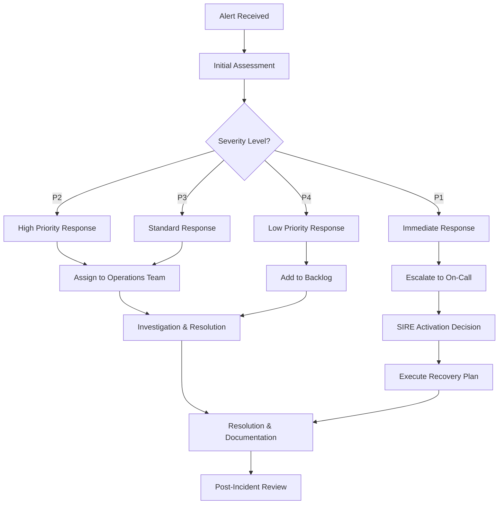

# SIRE Operations Guide

## Overview

This guide provides comprehensive operational procedures for managing and maintaining a Secure Isolated Recovery Environment (SIRE) in Microsoft Azure. It covers day-to-day operations, monitoring, maintenance, and troubleshooting procedures.

## Daily Operations

### Morning Health Checks

#### System Status Verification
```powershell
# Daily SIRE health check script
function Start-SIREHealthCheck {
    param(
        [string]$SubscriptionId = (Get-AzContext).Subscription.Id,
        [string]$ResourceGroup = "rg-sire-primary-prod"
    )
    
    $HealthReport = @{
        Timestamp = (Get-Date -Format "yyyy-MM-dd HH:mm:ss UTC")
        OverallStatus = "Unknown"
        Components = @{}
        Alerts = @()
        Recommendations = @()
    }
    
    try {
        # Check Azure connectivity
        $AzureTest = Test-AzureConnectivity
        $HealthReport.Components.Azure = $AzureTest
        
        # Check Recovery Services Vault
        $VaultTest = Test-RecoveryServicesVault -ResourceGroup $ResourceGroup
        $HealthReport.Components.RecoveryVault = $VaultTest
        
        # Check backup jobs
        $BackupTest = Test-BackupJobs -ResourceGroup $ResourceGroup
        $HealthReport.Components.BackupJobs = $BackupTest
        
        # Check SIRE infrastructure
        $InfraTest = Test-SIREInfrastructure -ResourceGroup $ResourceGroup
        $HealthReport.Components.Infrastructure = $InfraTest
        
        # Check security services
        $SecurityTest = Test-SecurityServices -ResourceGroup $ResourceGroup
        $HealthReport.Components.Security = $SecurityTest
        
        # Check monitoring services
        $MonitoringTest = Test-MonitoringServices -ResourceGroup $ResourceGroup
        $HealthReport.Components.Monitoring = $MonitoringTest
        
        # Determine overall status
        $FailedComponents = $HealthReport.Components.Values | Where-Object { $_.Status -eq "Failed" }
        $WarningComponents = $HealthReport.Components.Values | Where-Object { $_.Status -eq "Warning" }
        
        if ($FailedComponents.Count -gt 0) {
            $HealthReport.OverallStatus = "Critical"
        } elseif ($WarningComponents.Count -gt 0) {
            $HealthReport.OverallStatus = "Warning"
        } else {
            $HealthReport.OverallStatus = "Healthy"
        }
        
        # Generate report
        $ReportPath = "C:\temp\SIRE-HealthCheck-$(Get-Date -Format 'yyyyMMdd').json"
        $HealthReport | ConvertTo-Json -Depth 10 | Out-File $ReportPath
        
        # Send report
        Send-HealthReport -Report $HealthReport
        
        return $HealthReport
    }
    catch {
        Write-Error "Health check failed: $($_.Exception.Message)"
        Send-Alert -Type "HealthCheckFailure" -Message $_.Exception.Message
    }
}

function Test-AzureConnectivity {
    try {
        $Context = Get-AzContext
        if ($Context) {
            return @{
                Status = "Healthy"
                Message = "Azure connectivity verified"
                Details = @{
                    SubscriptionId = $Context.Subscription.Id
                    TenantId = $Context.Tenant.Id
                    Account = $Context.Account.Id
                }
            }
        } else {
            return @{
                Status = "Failed"
                Message = "No Azure context available"
            }
        }
    }
    catch {
        return @{
            Status = "Failed"
            Message = "Azure connectivity test failed: $($_.Exception.Message)"
        }
    }
}

function Test-RecoveryServicesVault {
    param([string]$ResourceGroup)
    
    try {
        $Vaults = Get-AzRecoveryServicesVault -ResourceGroupName $ResourceGroup
        
        $VaultStatus = @()
        foreach ($Vault in $Vaults) {
            $VaultProperties = Get-AzRecoveryServicesVaultProperty -Vault $Vault
            
            $VaultStatus += @{
                Name = $Vault.Name
                Status = if ($Vault.ProvisioningState -eq "Succeeded") { "Healthy" } else { "Failed" }
                StorageType = $VaultProperties.BackupStorageRedundancy
                SoftDeleteStatus = $VaultProperties.SoftDeleteFeatureState
                ImmutabilityStatus = "Enabled" # Check actual immutability status
            }
        }
        
        $FailedVaults = $VaultStatus | Where-Object { $_.Status -eq "Failed" }
        
        return @{
            Status = if ($FailedVaults.Count -eq 0) { "Healthy" } else { "Failed" }
            Message = "Found $($Vaults.Count) Recovery Services Vaults"
            Details = $VaultStatus
        }
    }
    catch {
        return @{
            Status = "Failed"
            Message = "Recovery Services Vault check failed: $($_.Exception.Message)"
        }
    }
}

function Test-BackupJobs {
    param([string]$ResourceGroup)
    
    try {
        $VaultName = "rsv-sire-primary"
        
        # Get backup jobs from last 24 hours
        $Jobs = Get-AzRecoveryServicesBackupJob -VaultId (Get-AzRecoveryServicesVault -Name $VaultName -ResourceGroupName $ResourceGroup).ID -From (Get-Date).AddDays(-1)
        
        $JobSummary = @{
            Total = $Jobs.Count
            Completed = ($Jobs | Where-Object { $_.Status -eq "Completed" }).Count
            InProgress = ($Jobs | Where-Object { $_.Status -eq "InProgress" }).Count
            Failed = ($Jobs | Where-Object { $_.Status -eq "Failed" }).Count
        }
        
        $Status = if ($JobSummary.Failed -eq 0) { "Healthy" } elseif ($JobSummary.Failed -le 2) { "Warning" } else { "Failed" }
        
        return @{
            Status = $Status
            Message = "Backup jobs in last 24 hours: $($JobSummary.Total) total, $($JobSummary.Failed) failed"
            Details = $JobSummary
        }
    }
    catch {
        return @{
            Status = "Failed"
            Message = "Backup jobs check failed: $($_.Exception.Message)"
        }
    }
}

# Schedule daily health check
Register-ScheduledJob -Name "SIRE-DailyHealthCheck" -ScriptBlock {
    Start-SIREHealthCheck
} -Trigger (New-JobTrigger -Daily -At "08:00")
```

#### Backup Status Review
```bash
#!/bin/bash
# Daily backup status check

VAULT_NAME="rsv-sire-primary"
RESOURCE_GROUP="rg-sire-primary-prod"
REPORT_DATE=$(date +%Y-%m-%d)

echo "SIRE Backup Status Report - $REPORT_DATE"
echo "=============================================="

# Check backup job status
echo "Backup Jobs (Last 24 hours):"
az backup job list \
  --resource-group "$RESOURCE_GROUP" \
  --vault-name "$VAULT_NAME" \
  --start-time "$(date -d '1 day ago' -u +%Y-%m-%dT%H:%M:%SZ)" \
  --query "[].{Name:entityFriendlyName, Status:status, StartTime:startTime, EndTime:endTime}" \
  --output table

# Check protected items
echo -e "\nProtected Items Status:"
az backup item list \
  --resource-group "$RESOURCE_GROUP" \
  --vault-name "$VAULT_NAME" \
  --query "[].{Name:friendlyName, ProtectionStatus:protectionStatus, LastBackup:lastBackupTime}" \
  --output table

# Check vault storage usage
echo -e "\nVault Storage Usage:"
az backup vault backup-properties show \
  --resource-group "$RESOURCE_GROUP" \
  --name "$VAULT_NAME" \
  --query "{StorageType:storageModelType, Encryption:encryptionSettings}" \
  --output table

# Generate alerts for failed backups
FAILED_JOBS=$(az backup job list \
  --resource-group "$RESOURCE_GROUP" \
  --vault-name "$VAULT_NAME" \
  --status "Failed" \
  --start-time "$(date -d '1 day ago' -u +%Y-%m-%dT%H:%M:%SZ)" \
  --query "length(@)")

if [ "$FAILED_JOBS" -gt 0 ]; then
    echo "ALERT: $FAILED_JOBS failed backup jobs detected"
    # Send alert to operations team
    send_alert "backup_failure" "Failed backup jobs detected: $FAILED_JOBS"
fi

echo "Backup status check completed"
```

### Security Monitoring

#### Daily Security Assessment
```powershell
# Daily security monitoring script
function Start-SIRESecurityCheck {
    param(
        [string]$ResourceGroup = "rg-sire-primary-prod",
        [string]$WorkspaceName = "law-sire-primary"
    )
    
    $SecurityReport = @{
        Date = Get-Date
        Alerts = @()
        Recommendations = @()
        ComplianceStatus = @{}
    }
    
    try {
        # Check Microsoft Defender for Cloud alerts
        $DefenderAlerts = Get-AzSecurityAlert | Where-Object { $_.State -eq "Active" }
        
        foreach ($Alert in $DefenderAlerts) {
            $SecurityReport.Alerts += @{
                AlertName = $Alert.AlertDisplayName
                Severity = $Alert.ReportedSeverity
                Description = $Alert.Description
                CompromisedEntity = $Alert.CompromisedEntity
                DetectedTime = $Alert.DetectedTimeUtc
            }
        }
        
        # Check Azure Policy compliance
        $PolicyStates = Get-AzPolicyState -ResourceGroupName $ResourceGroup | Where-Object { $_.ComplianceState -eq "NonCompliant" }
        
        foreach ($Policy in $PolicyStates) {
            $SecurityReport.ComplianceStatus[$Policy.PolicyDefinitionName] = @{
                Status = $Policy.ComplianceState
                ResourceId = $Policy.ResourceId
                PolicyDefinition = $Policy.PolicyDefinitionName
            }
        }
        
        # Check Key Vault access logs
        $KVLogs = Invoke-AzOperationalInsightsQuery -WorkspaceId (Get-AzOperationalInsightsWorkspace -ResourceGroupName $ResourceGroup -Name $WorkspaceName).CustomerId -Query @"
KeyVaultData
| where TimeGenerated > ago(24h)
| where OperationName contains "SecretGet" or OperationName contains "KeyGet"
| summarize AccessCount = count() by CallerIPAddress, OperationName
| where AccessCount > 100
"@
        
        if ($KVLogs.Results.Count -gt 0) {
            $SecurityReport.Alerts += @{
                AlertName = "Unusual Key Vault Access"
                Severity = "Medium"
                Description = "High volume Key Vault access detected"
                Details = $KVLogs.Results
            }
        }
        
        # Generate security recommendations
        if ($SecurityReport.Alerts.Count -gt 0) {
            $SecurityReport.Recommendations += "Review and investigate active security alerts"
        }
        
        if ($SecurityReport.ComplianceStatus.Count -gt 0) {
            $SecurityReport.Recommendations += "Address policy compliance violations"
        }
        
        # Output report
        Write-Host "SIRE Security Report - $(Get-Date -Format 'yyyy-MM-dd HH:mm')"
        Write-Host "Active Alerts: $($SecurityReport.Alerts.Count)"
        Write-Host "Compliance Issues: $($SecurityReport.ComplianceStatus.Count)"
        
        if ($SecurityReport.Alerts.Count -gt 0) {
            Write-Host "Security Alerts:" -ForegroundColor Yellow
            $SecurityReport.Alerts | ForEach-Object {
                Write-Host "  - [$($_.Severity)] $($_.AlertName)" -ForegroundColor Red
            }
        }
        
        return $SecurityReport
    }
    catch {
        Write-Error "Security check failed: $($_.Exception.Message)"
        Send-Alert -Type "SecurityCheckFailure" -Message $_.Exception.Message
    }
}
```

## Monitoring and Alerting

### Azure Monitor Configuration

#### Log Analytics Queries
```kusto
// SIRE Environment Health Query
union withsource = TableName 
    Heartbeat,
    SecurityEvent,
    Syslog,
    Event,
    AzureActivity
| where TimeGenerated > ago(1h)
| where Computer contains "sire" or ResourceGroup contains "sire"
| summarize Count = count() by TableName, bin(TimeGenerated, 5m)
| render timechart

// Failed Authentication Attempts
SecurityEvent
| where TimeGenerated > ago(24h)
| where EventID in (4625, 4771, 4776)
| where Computer contains "sire"
| summarize FailedAttempts = count() by Account, Computer, bin(TimeGenerated, 1h)
| where FailedAttempts > 5
| order by FailedAttempts desc

// Backup Job Failures
AzureDiagnostics
| where TimeGenerated > ago(24h)
| where Category == "AzureBackupReport"
| where OperationName == "Job"
| where JobStatus == "Failed"
| project TimeGenerated, JobOperation, JobStatus, JobFailureCode, ResourceId
| order by TimeGenerated desc

// Resource Health Status
AzureActivity
| where TimeGenerated > ago(1h)
| where OperationNameValue contains "MICROSOFT.RECOVERYSERVICES"
| where ActivityStatusValue != "Success"
| project TimeGenerated, ResourceGroup, ResourceProviderValue, OperationNameValue, ActivityStatusValue
| order by TimeGenerated desc

// Network Security Group Changes
AzureActivity
| where TimeGenerated > ago(24h)
| where OperationNameValue contains "MICROSOFT.NETWORK/NETWORKSECURITYGROUPS"
| where ActivityStatusValue == "Success"
| project TimeGenerated, Caller, OperationNameValue, ResourceGroup, ResourceId
| order by TimeGenerated desc
```

#### Alert Rules Configuration
```json
{
  "alertRules": [
    {
      "name": "SIRE-Backup-Job-Failure",
      "description": "Alert when backup jobs fail in SIRE environment",
      "severity": 1,
      "enabled": true,
      "query": "AzureDiagnostics | where Category == 'AzureBackupReport' and JobStatus == 'Failed' and TimeGenerated > ago(1h)",
      "frequency": "PT5M",
      "timeWindow": "PT1H",
      "threshold": {
        "operator": "GreaterThan",
        "value": 0
      },
      "actions": [
        {
          "actionGroupId": "/subscriptions/{subscription-id}/resourceGroups/rg-sire-primary-prod/providers/Microsoft.Insights/actionGroups/sire-critical-alerts",
          "webhookProperties": {
            "alertType": "BackupFailure",
            "environment": "SIRE"
          }
        }
      ]
    },
    {
      "name": "SIRE-Unusual-Authentication-Activity",
      "description": "Alert on unusual authentication patterns in SIRE",
      "severity": 2,
      "enabled": true,
      "query": "SecurityEvent | where EventID in (4625, 4771) and Computer contains 'sire' | summarize count() by Account, bin(TimeGenerated, 1h) | where count_ > 10",
      "frequency": "PT15M",
      "timeWindow": "PT1H",
      "threshold": {
        "operator": "GreaterThan",
        "value": 0
      }
    },
    {
      "name": "SIRE-Infrastructure-Health",
      "description": "Monitor SIRE infrastructure component health",
      "severity": 2,
      "enabled": true,
      "query": "Heartbeat | where Computer contains 'sire' | summarize LastHeartbeat = max(TimeGenerated) by Computer | where LastHeartbeat < ago(10m)",
      "frequency": "PT5M",
      "timeWindow": "PT15M",
      "threshold": {
        "operator": "GreaterThan",
        "value": 0
      }
    },
    {
      "name": "SIRE-Storage-Usage-High",
      "description": "Alert when SIRE storage usage exceeds 80%",
      "severity": 2,
      "enabled": true,
      "query": "Perf | where Computer contains 'sire' and CounterName == '% Free Space' and InstanceName != '_Total' | summarize AvgFreeSpace = avg(CounterValue) by Computer, InstanceName | where AvgFreeSpace < 20",
      "frequency": "PT30M",
      "timeWindow": "PT1H",
      "threshold": {
        "operator": "GreaterThan",
        "value": 0
      }
    }
  ]
}
```

### Dashboard Configuration

#### SIRE Operations Dashboard
```json
{
  "dashboard": {
    "title": "SIRE Operations Dashboard",
    "time": {
      "from": "now-24h",
      "to": "now"
    },
    "panels": [
      {
        "title": "SIRE Environment Status",
        "type": "stat",
        "gridPos": {"h": 4, "w": 6, "x": 0, "y": 0},
        "targets": [
          {
            "query": "Heartbeat | where Computer contains 'sire' | summarize online = dcount(Computer)",
            "refId": "A"
          }
        ],
        "fieldConfig": {
          "defaults": {
            "color": {
              "mode": "thresholds"
            },
            "thresholds": {
              "steps": [
                {"color": "red", "value": 0},
                {"color": "yellow", "value": 5},
                {"color": "green", "value": 10}
              ]
            }
          }
        }
      },
      {
        "title": "Backup Job Status (24h)",
        "type": "piechart",
        "gridPos": {"h": 4, "w": 6, "x": 6, "y": 0},
        "targets": [
          {
            "query": "AzureDiagnostics | where Category == 'AzureBackupReport' and TimeGenerated > ago(24h) | summarize count() by JobStatus",
            "refId": "A"
          }
        ]
      },
      {
        "title": "Security Alerts (7d)",
        "type": "timeseries",
        "gridPos": {"h": 8, "w": 12, "x": 0, "y": 4},
        "targets": [
          {
            "query": "SecurityAlert | where TimeGenerated > ago(7d) | summarize AlertCount = count() by bin(TimeGenerated, 1h), AlertSeverity",
            "refId": "A"
          }
        ]
      },
      {
        "title": "Resource Utilization",
        "type": "timeseries",
        "gridPos": {"h": 8, "w": 12, "x": 12, "y": 4},
        "targets": [
          {
            "query": "Perf | where Computer contains 'sire' and CounterName in ('% Processor Time', '% Memory Used') | summarize avg(CounterValue) by CounterName, bin(TimeGenerated, 5m)",
            "refId": "A"
          }
        ]
      }
    ]
  }
}
```

## Maintenance Procedures

### Weekly Maintenance Tasks

#### System Updates and Patching
```powershell
# Weekly SIRE maintenance script
function Start-SIREWeeklyMaintenance {
    param(
        [string]$ResourceGroup = "rg-sire-primary-prod",
        [string]$MaintenanceWindow = "Saturday 02:00-06:00"
    )
    
    $MaintenanceLog = @{
        StartTime = Get-Date
        Tasks = @()
        Errors = @()
    }
    
    try {
        Write-Host "Starting SIRE weekly maintenance - $(Get-Date)"
        
        # Task 1: Check and install Windows updates
        $UpdateTask = Start-WindowsUpdateInstallation
        $MaintenanceLog.Tasks += $UpdateTask
        
        # Task 2: Update Azure PowerShell modules
        $ModuleTask = Update-AzureModules
        $MaintenanceLog.Tasks += $ModuleTask
        
        # Task 3: Clean temporary files and logs
        $CleanupTask = Start-SystemCleanup
        $MaintenanceLog.Tasks += $CleanupTask
        
        # Task 4: Verify backup integrity
        $BackupTask = Test-BackupIntegrity
        $MaintenanceLog.Tasks += $BackupTask
        
        # Task 5: Update security baselines
        $SecurityTask = Update-SecurityBaselines
        $MaintenanceLog.Tasks += $SecurityTask
        
        # Task 6: Performance optimization
        $PerfTask = Optimize-SystemPerformance
        $MaintenanceLog.Tasks += $PerfTask
        
        $MaintenanceLog.EndTime = Get-Date
        $MaintenanceLog.Duration = $MaintenanceLog.EndTime - $MaintenanceLog.StartTime
        
        # Generate maintenance report
        $ReportPath = "C:\maintenance\SIRE-Maintenance-$(Get-Date -Format 'yyyyMMdd').json"
        $MaintenanceLog | ConvertTo-Json -Depth 10 | Out-File $ReportPath
        
        Write-Host "SIRE weekly maintenance completed successfully"
        Send-MaintenanceReport -Log $MaintenanceLog
    }
    catch {
        $MaintenanceLog.Errors += @{
            Task = "Maintenance Process"
            Error = $_.Exception.Message
            Timestamp = Get-Date
        }
        
        Write-Error "Maintenance failed: $($_.Exception.Message)"
        Send-Alert -Type "MaintenanceFailure" -Message $_.Exception.Message
    }
}

function Start-WindowsUpdateInstallation {
    try {
        Write-Host "Installing Windows updates..."
        
        # Install PSWindowsUpdate module if not present
        if (-not (Get-Module -ListAvailable PSWindowsUpdate)) {
            Install-Module PSWindowsUpdate -Force
        }
        
        # Install updates
        $Updates = Get-WUInstall -AcceptAll -AutoReboot:$false
        
        return @{
            TaskName = "Windows Updates"
            Status = "Completed"
            UpdatesInstalled = $Updates.Count
            RebootRequired = (Get-WURebootStatus).RebootRequired
        }
    }
    catch {
        return @{
            TaskName = "Windows Updates"
            Status = "Failed"
            Error = $_.Exception.Message
        }
    }
}

function Update-SecurityBaselines {
    try {
        Write-Host "Updating security baselines..."
        
        # Update Windows Defender signatures
        Update-MpSignature
        
        # Run security compliance scan
        Start-Process -FilePath "secedit" -ArgumentList "/configure /cfg C:\Windows\Security\Templates\SecureBaseline.inf /db secedit.sdb" -Wait
        
        # Update firewall rules
        Import-Module NetSecurity
        # Apply updated firewall rules
        
        return @{
            TaskName = "Security Baselines"
            Status = "Completed"
            DefenderSignatures = "Updated"
            FirewallRules = "Updated"
        }
    }
    catch {
        return @{
            TaskName = "Security Baselines"
            Status = "Failed"
            Error = $_.Exception.Message
        }
    }
}
```

#### Database Maintenance
```sql
-- Weekly database maintenance for SIRE environment
-- Run this script during maintenance windows

USE master;
GO

-- Create maintenance log table if it doesn't exist
IF NOT EXISTS (SELECT * FROM sys.tables WHERE name = 'MaintenanceLog')
BEGIN
    CREATE TABLE MaintenanceLog (
        ID INT IDENTITY(1,1) PRIMARY KEY,
        TaskName NVARCHAR(100),
        DatabaseName NVARCHAR(100),
        StartTime DATETIME2,
        EndTime DATETIME2,
        Status NVARCHAR(20),
        Details NVARCHAR(MAX)
    );
END

DECLARE @StartTime DATETIME2 = GETDATE();
DECLARE @DatabaseName NVARCHAR(100);
DECLARE @SQL NVARCHAR(MAX);

-- Cursor for all user databases
DECLARE db_cursor CURSOR FOR
SELECT name FROM sys.databases 
WHERE state = 0 AND name NOT IN ('master', 'tempdb', 'model', 'msdb');

OPEN db_cursor;
FETCH NEXT FROM db_cursor INTO @DatabaseName;

WHILE @@FETCH_STATUS = 0
BEGIN
    PRINT 'Processing database: ' + @DatabaseName;
    
    -- Update statistics
    BEGIN TRY
        SET @SQL = 'USE [' + @DatabaseName + ']; EXEC sp_updatestats;';
        EXEC sp_executesql @SQL;
        
        INSERT INTO MaintenanceLog (TaskName, DatabaseName, StartTime, EndTime, Status, Details)
        VALUES ('Update Statistics', @DatabaseName, @StartTime, GETDATE(), 'Success', 'Statistics updated successfully');
    END TRY
    BEGIN CATCH
        INSERT INTO MaintenanceLog (TaskName, DatabaseName, StartTime, EndTime, Status, Details)
        VALUES ('Update Statistics', @DatabaseName, @StartTime, GETDATE(), 'Failed', ERROR_MESSAGE());
    END CATCH
    
    -- Reorganize indexes
    BEGIN TRY
        SET @SQL = 'USE [' + @DatabaseName + ']; 
                   DECLARE @cmd NVARCHAR(MAX);
                   SELECT @cmd = STRING_AGG(''ALTER INDEX '' + QUOTENAME(i.name) + '' ON '' + QUOTENAME(s.name) + ''.'' + QUOTENAME(o.name) + '' REORGANIZE;'', '' '')
                   FROM sys.indexes i
                   INNER JOIN sys.objects o ON i.object_id = o.object_id
                   INNER JOIN sys.schemas s ON o.schema_id = s.schema_id
                   WHERE i.type_desc = ''NONCLUSTERED'' AND i.is_disabled = 0;
                   EXEC sp_executesql @cmd;';
        EXEC sp_executesql @SQL;
        
        INSERT INTO MaintenanceLog (TaskName, DatabaseName, StartTime, EndTime, Status, Details)
        VALUES ('Reorganize Indexes', @DatabaseName, @StartTime, GETDATE(), 'Success', 'Indexes reorganized successfully');
    END TRY
    BEGIN CATCH
        INSERT INTO MaintenanceLog (TaskName, DatabaseName, StartTime, EndTime, Status, Details)
        VALUES ('Reorganize Indexes', @DatabaseName, @StartTime, GETDATE(), 'Failed', ERROR_MESSAGE());
    END CATCH
    
    -- Check database integrity
    BEGIN TRY
        SET @SQL = 'DBCC CHECKDB(''' + @DatabaseName + ''') WITH NO_INFOMSGS;';
        EXEC sp_executesql @SQL;
        
        INSERT INTO MaintenanceLog (TaskName, DatabaseName, StartTime, EndTime, Status, Details)
        VALUES ('Database Integrity Check', @DatabaseName, @StartTime, GETDATE(), 'Success', 'Database integrity verified');
    END TRY
    BEGIN CATCH
        INSERT INTO MaintenanceLog (TaskName, DatabaseName, StartTime, EndTime, Status, Details)
        VALUES ('Database Integrity Check', @DatabaseName, @StartTime, GETDATE(), 'Failed', ERROR_MESSAGE());
    END CATCH
    
    FETCH NEXT FROM db_cursor INTO @DatabaseName;
END

CLOSE db_cursor;
DEALLOCATE db_cursor;

-- Generate maintenance summary
SELECT 
    TaskName,
    COUNT(*) as TotalDatabases,
    SUM(CASE WHEN Status = 'Success' THEN 1 ELSE 0 END) as SuccessCount,
    SUM(CASE WHEN Status = 'Failed' THEN 1 ELSE 0 END) as FailedCount
FROM MaintenanceLog
WHERE StartTime >= @StartTime
GROUP BY TaskName;

PRINT 'Database maintenance completed at: ' + CONVERT(VARCHAR, GETDATE());
```

### Monthly Maintenance Tasks

#### Capacity Planning Review
```powershell
# Monthly capacity planning script
function Start-SIRECapacityReview {
    param(
        [string]$ResourceGroup = "rg-sire-primary-prod",
        [int]$LookbackDays = 30
    )
    
    $CapacityReport = @{
        ReviewDate = Get-Date
        LookbackPeriod = $LookbackDays
        Storage = @{}
        Compute = @{}
        Network = @{}
        Recommendations = @()
    }
    
    try {
        # Storage capacity analysis
        $StorageAccounts = Get-AzStorageAccount -ResourceGroupName $ResourceGroup
        
        foreach ($Account in $StorageAccounts) {
            $Context = $Account.Context
            $Containers = Get-AzStorageContainer -Context $Context
            
            $TotalSize = 0
            foreach ($Container in $Containers) {
                $Blobs = Get-AzStorageBlob -Container $Container.Name -Context $Context
                $ContainerSize = ($Blobs | Measure-Object -Property Length -Sum).Sum
                $TotalSize += $ContainerSize
            }
            
            $CapacityReport.Storage[$Account.StorageAccountName] = @{
                TotalSizeGB = [math]::Round($TotalSize / 1GB, 2)
                ContainerCount = $Containers.Count
                GrowthTrend = Get-StorageGrowthTrend -AccountName $Account.StorageAccountName -Days $LookbackDays
            }
        }
        
        # Compute capacity analysis
        $VMs = Get-AzVM -ResourceGroupName $ResourceGroup
        
        foreach ($VM in $VMs) {
            $VMSize = Get-AzVMSize -Location $VM.Location | Where-Object { $_.Name -eq $VM.HardwareProfile.VmSize }
            
            $CapacityReport.Compute[$VM.Name] = @{
                VMSize = $VM.HardwareProfile.VmSize
                Cores = $VMSize.NumberOfCores
                MemoryMB = $VMSize.MemoryInMB
                Status = $VM.PowerState
                Utilization = Get-VMUtilization -VMName $VM.Name -Days $LookbackDays
            }
        }
        
        # Generate recommendations
        foreach ($Storage in $CapacityReport.Storage.Keys) {
            if ($CapacityReport.Storage[$Storage].TotalSizeGB -gt 800) {
                $CapacityReport.Recommendations += "Consider implementing storage lifecycle management for $Storage"
            }
        }
        
        foreach ($VM in $CapacityReport.Compute.Keys) {
            $Util = $CapacityReport.Compute[$VM].Utilization
            if ($Util.AvgCPU -lt 20) {
                $CapacityReport.Recommendations += "VM $VM appears underutilized (Avg CPU: $($Util.AvgCPU)%)"
            }
            if ($Util.AvgMemory -gt 80) {
                $CapacityReport.Recommendations += "VM $VM may need memory upgrade (Avg Memory: $($Util.AvgMemory)%)"
            }
        }
        
        # Export report
        $ReportPath = "C:\reports\SIRE-Capacity-$(Get-Date -Format 'yyyyMM').json"
        $CapacityReport | ConvertTo-Json -Depth 10 | Out-File $ReportPath
        
        Write-Host "Capacity review completed. Report saved to: $ReportPath"
        
        return $CapacityReport
    }
    catch {
        Write-Error "Capacity review failed: $($_.Exception.Message)"
    }
}
```

## Incident Response Procedures

### Incident Classification

#### Severity Levels
| Severity | Description | Response Time | Examples |
|----------|-------------|---------------|----------|
| P1 - Critical | SIRE environment unavailable or compromised | 15 minutes | Complete service outage, security breach |
| P2 - High | Significant service degradation | 1 hour | Backup failures, authentication issues |
| P3 - Medium | Minor service impact | 4 hours | Non-critical alerts, capacity warnings |
| P4 - Low | No service impact | 24 hours | Documentation updates, routine maintenance |

#### Incident Response Workflow


### Emergency Procedures

#### SIRE Emergency Activation
```powershell
# Emergency SIRE activation script
function Start-SIREEmergencyActivation {
    param(
        [Parameter(Mandatory = $true)]
        [string]$IncidentID,
        
        [Parameter(Mandatory = $true)]
        [ValidateSet("Ransomware", "DataBreach", "SystemCompromise", "InfrastructureFailure")]
        [string]$IncidentType,
        
        [Parameter(Mandatory = $true)]
        [string]$IncidentCommander,
        
        [string]$ResourceGroup = "rg-sire-primary-prod"
    )
    
    $ActivationLog = @{
        IncidentID = $IncidentID
        IncidentType = $IncidentType
        IncidentCommander = $IncidentCommander
        ActivationTime = Get-Date
        Steps = @()
        Status = "In Progress"
    }
    
    try {
        Write-Host "EMERGENCY: SIRE Activation Initiated" -ForegroundColor Red
        Write-Host "Incident ID: $IncidentID" -ForegroundColor Yellow
        Write-Host "Incident Type: $IncidentType" -ForegroundColor Yellow
        Write-Host "Incident Commander: $IncidentCommander" -ForegroundColor Yellow
        
        # Step 1: Send immediate notifications
        $NotificationStep = Send-EmergencyNotifications -IncidentID $IncidentID -Type $IncidentType
        $ActivationLog.Steps += $NotificationStep
        
        # Step 2: Isolate production environment (if required)
        if ($IncidentType -in @("Ransomware", "SystemCompromise")) {
            $IsolationStep = Start-ProductionIsolation
            $ActivationLog.Steps += $IsolationStep
        }
        
        # Step 3: Verify SIRE environment readiness
        $ReadinessStep = Test-SIREReadiness
        $ActivationLog.Steps += $ReadinessStep
        
        if ($ReadinessStep.Status -ne "Success") {
            throw "SIRE environment not ready for activation"
        }
        
        # Step 4: Activate recovery services
        $RecoveryStep = Start-RecoveryServices
        $ActivationLog.Steps += $RecoveryStep
        
        # Step 5: Initiate data recovery
        $DataRecoveryStep = Start-DataRecovery -IncidentType $IncidentType
        $ActivationLog.Steps += $DataRecoveryStep
        
        # Step 6: Validate recovery environment
        $ValidationStep = Test-RecoveryEnvironment
        $ActivationLog.Steps += $ValidationStep
        
        $ActivationLog.Status = "Completed"
        $ActivationLog.CompletionTime = Get-Date
        
        Write-Host "SIRE Emergency Activation Completed Successfully" -ForegroundColor Green
        
        # Generate activation report
        $ReportPath = "C:\emergency\SIRE-Activation-$IncidentID.json"
        $ActivationLog | ConvertTo-Json -Depth 10 | Out-File $ReportPath
        
        # Send completion notification
        Send-ActivationCompletionNotification -IncidentID $IncidentID -ReportPath $ReportPath
        
        return $ActivationLog
    }
    catch {
        $ActivationLog.Status = "Failed"
        $ActivationLog.Error = $_.Exception.Message
        $ActivationLog.FailureTime = Get-Date
        
        Write-Error "SIRE Emergency Activation Failed: $($_.Exception.Message)"
        Send-ActivationFailureNotification -IncidentID $IncidentID -Error $_.Exception.Message
        
        return $ActivationLog
    }
}

function Send-EmergencyNotifications {
    param(
        [string]$IncidentID,
        [string]$Type
    )
    
    try {
        # Emergency notification list
        $NotificationList = @{
            "Critical" = @("ciso@company.com", "it-director@company.com", "ceo@company.com")
            "Operations" = @("ops-team@company.com", "sire-team@company.com")
            "Legal" = @("legal@company.com", "compliance@company.com")
        }
        
        $Subject = "EMERGENCY: SIRE Environment Activation - Incident $IncidentID"
        $Body = @"
EMERGENCY NOTIFICATION

SIRE Environment Emergency Activation has been initiated.

Incident Details:
- Incident ID: $IncidentID
- Incident Type: $Type
- Activation Time: $(Get-Date -Format 'yyyy-MM-dd HH:mm:ss UTC')

This is an automated notification. Please follow your incident response procedures.

SIRE Operations Team
"@
        
        # Send notifications to all groups
        foreach ($Group in $NotificationList.Keys) {
            foreach ($Recipient in $NotificationList[$Group]) {
                Send-MailMessage -To $Recipient -Subject $Subject -Body $Body -SmtpServer "smtp.company.com"
            }
        }
        
        # Send SMS notifications to key personnel
        Send-SMSAlert -Message "EMERGENCY: SIRE Activation initiated for incident $IncidentID ($Type)" -Recipients @("+1234567890", "+1987654321")
        
        return @{
            Step = "Emergency Notifications"
            Status = "Success"
            NotificationsSent = ($NotificationList.Values | ForEach-Object { $_.Count } | Measure-Object -Sum).Sum
        }
    }
    catch {
        return @{
            Step = "Emergency Notifications"
            Status = "Failed"
            Error = $_.Exception.Message
        }
    }
}
```

## Performance Optimization

### Regular Performance Reviews

#### System Performance Analysis
```powershell
# Weekly performance analysis script
function Start-SIREPerformanceAnalysis {
    param(
        [string]$ResourceGroup = "rg-sire-primary-prod",
        [int]$AnalysisDays = 7
    )
    
    $PerformanceReport = @{
        AnalysisDate = Get-Date
        Period = $AnalysisDays
        Metrics = @{}
        Recommendations = @()
        Trends = @{}
    }
    
    try {
        # VM Performance Analysis
        $VMs = Get-AzVM -ResourceGroupName $ResourceGroup
        
        foreach ($VM in $VMs) {
            $VMMetrics = Get-VMPerformanceMetrics -VMName $VM.Name -Days $AnalysisDays
            
            $PerformanceReport.Metrics[$VM.Name] = $VMMetrics
            
            # Generate recommendations based on metrics
            if ($VMMetrics.AvgCPU -gt 80) {
                $PerformanceReport.Recommendations += "Consider scaling up VM $($VM.Name) - High CPU utilization ($($VMMetrics.AvgCPU)%)"
            }
            
            if ($VMMetrics.AvgMemory -gt 85) {
                $PerformanceReport.Recommendations += "Consider increasing memory for VM $($VM.Name) - High memory utilization ($($VMMetrics.AvgMemory)%)"
            }
            
            if ($VMMetrics.DiskIOPS -gt 1000) {
                $PerformanceReport.Recommendations += "Consider Premium SSD for VM $($VM.Name) - High disk IOPS ($($VMMetrics.DiskIOPS))"
            }
        }
        
        # Storage Performance Analysis
        $StorageAccounts = Get-AzStorageAccount -ResourceGroupName $ResourceGroup
        
        foreach ($Storage in $StorageAccounts) {
            $StorageMetrics = Get-StoragePerformanceMetrics -AccountName $Storage.StorageAccountName -Days $AnalysisDays
            
            $PerformanceReport.Metrics[$Storage.StorageAccountName] = $StorageMetrics
            
            if ($StorageMetrics.AvgLatency -gt 100) {
                $PerformanceReport.Recommendations += "High storage latency detected for $($Storage.StorageAccountName) - Consider Premium storage"
            }
        }
        
        # Network Performance Analysis
        $NetworkMetrics = Get-NetworkPerformanceMetrics -ResourceGroup $ResourceGroup -Days $AnalysisDays
        $PerformanceReport.Metrics["Network"] = $NetworkMetrics
        
        # Generate trend analysis
        $PerformanceReport.Trends = Get-PerformanceTrends -ResourceGroup $ResourceGroup -Days $AnalysisDays
        
        # Export report
        $ReportPath = "C:\reports\SIRE-Performance-$(Get-Date -Format 'yyyyMMdd').json"
        $PerformanceReport | ConvertTo-Json -Depth 10 | Out-File $ReportPath
        
        Write-Host "Performance analysis completed. $($PerformanceReport.Recommendations.Count) recommendations generated."
        
        return $PerformanceReport
    }
    catch {
        Write-Error "Performance analysis failed: $($_.Exception.Message)"
    }
}
```

## Troubleshooting Procedures

### Common Issues and Solutions

#### Issue 1: Backup Job Failures
```powershell
# Backup troubleshooting script
function Repair-BackupIssues {
    param(
        [string]$VaultName = "rsv-sire-primary",
        [string]$ResourceGroup = "rg-sire-primary-prod"
    )
    
    $TroubleshootingResults = @()
    
    try {
        # Check vault status
        $Vault = Get-AzRecoveryServicesVault -Name $VaultName -ResourceGroupName $ResourceGroup
        
        if ($Vault.ProvisioningState -ne "Succeeded") {
            $TroubleshootingResults += @{
                Issue = "Vault Provisioning"
                Status = "Failed"
                Resolution = "Vault is not in Succeeded state: $($Vault.ProvisioningState)"
            }
        }
        
        # Check failed backup jobs
        $FailedJobs = Get-AzRecoveryServicesBackupJob -VaultId $Vault.ID -Status "Failed" -From (Get-Date).AddDays(-7)
        
        foreach ($Job in $FailedJobs) {
            $JobDetails = Get-AzRecoveryServicesBackupJobDetail -Job $Job
            
            $Resolution = switch ($JobDetails.ErrorDetails.ErrorCode) {
                "UserErrorVmNotInDesirableState" { "VM is not in a suitable state for backup. Check VM status." }
                "ExtensionSnapshotFailedCOM" { "Restart VSS service and VM agent, then retry backup." }
                "ExtensionInstallationFailure" { "Reinstall backup extension on the VM." }
                "UserErrorBcmPremiumStorageQuotaError" { "Premium storage quota exceeded. Clean up old recovery points." }
                default { "Review detailed error message: $($JobDetails.ErrorDetails.ErrorMessage)" }
            }
            
            $TroubleshootingResults += @{
                Issue = "Backup Job Failure"
                ItemName = $Job.WorkloadName
                ErrorCode = $JobDetails.ErrorDetails.ErrorCode
                Resolution = $Resolution
            }
        }
        
        # Check backup policies
        $Policies = Get-AzRecoveryServicesBackupProtectionPolicy -VaultId $Vault.ID
        
        foreach ($Policy in $Policies) {
            if ($Policy.SchedulePolicy.ScheduleRunTimes.Count -eq 0) {
                $TroubleshootingResults += @{
                    Issue = "Policy Configuration"
                    PolicyName = $Policy.Name
                    Resolution = "Backup policy has no scheduled run times configured"
                }
            }
        }
        
        return $TroubleshootingResults
    }
    catch {
        Write-Error "Backup troubleshooting failed: $($_.Exception.Message)"
    }
}
```

#### Issue 2: Network Connectivity Problems
```bash
#!/bin/bash
# Network troubleshooting script for SIRE environment

diagnose_network_issues() {
    local resource_group="rg-sire-primary-prod"
    local vnet_name="vnet-sire-primary"
    
    echo "SIRE Network Diagnostics - $(date)"
    echo "======================================"
    
    # Check VNet status
    echo "1. Checking VNet status..."
    az network vnet show \
        --resource-group "$resource_group" \
        --name "$vnet_name" \
        --query "{Name:name, State:provisioningState, AddressSpace:addressSpace.addressPrefixes}" \
        --output table
    
    # Check subnet configurations
    echo -e "\n2. Checking subnet configurations..."
    az network vnet subnet list \
        --resource-group "$resource_group" \
        --vnet-name "$vnet_name" \
        --query "[].{Name:name, AddressPrefix:addressPrefix, NSG:networkSecurityGroup.id}" \
        --output table
    
    # Check NSG rules
    echo -e "\n3. Checking NSG rules..."
    for nsg in $(az network nsg list --resource-group "$resource_group" --query "[].name" -o tsv); do
        echo "NSG: $nsg"
        az network nsg rule list \
            --resource-group "$resource_group" \
            --nsg-name "$nsg" \
            --query "[].{Name:name, Priority:priority, Access:access, Protocol:protocol, Direction:direction}" \
            --output table
    done
    
    # Check route tables
    echo -e "\n4. Checking route tables..."
    az network route-table list \
        --resource-group "$resource_group" \
        --query "[].{Name:name, Location:location, Routes:routes[].{Name:name, AddressPrefix:addressPrefix, NextHop:nextHopType}}" \
        --output table
    
    # Check private endpoints
    echo -e "\n5. Checking private endpoints..."
    az network private-endpoint list \
        --resource-group "$resource_group" \
        --query "[].{Name:name, State:provisioningState, Subnet:subnet.id}" \
        --output table
    
    # Test connectivity to key services
    echo -e "\n6. Testing connectivity to key services..."
    test_service_connectivity "kv-sire-primary-prod.vault.azure.net" 443
    test_service_connectivity "stsirebackup.blob.core.windows.net" 443
    test_service_connectivity "rsv-sire-primary.vault.azure.net" 443
    
    echo -e "\nNetwork diagnostics completed"
}

test_service_connectivity() {
    local service=$1
    local port=$2
    
    if nc -z -w5 "$service" "$port" 2>/dev/null; then
        echo "✓ $service:$port - Connected"
    else
        echo "✗ $service:$port - Failed"
        # Additional troubleshooting
        nslookup "$service"
        traceroute "$service" 2>/dev/null | head -10
    fi
}

# Run diagnostics
diagnose_network_issues
```

## Automation and Scripting

### PowerShell Automation Framework
```powershell
# SIRE automation framework
class SIREAutomation {
    [string]$ResourceGroup
    [string]$SubscriptionId
    [hashtable]$Configuration
    
    SIREAutomation([string]$resourceGroup, [string]$subscriptionId) {
        $this.ResourceGroup = $resourceGroup
        $this.SubscriptionId = $subscriptionId
        $this.Configuration = @{}
        $this.Initialize()
    }
    
    [void]Initialize() {
        # Set Azure context
        Set-AzContext -SubscriptionId $this.SubscriptionId
        
        # Load configuration
        $this.LoadConfiguration()
        
        # Initialize logging
        $this.InitializeLogging()
    }
    
    [void]LoadConfiguration() {
        $configPath = "C:\config\sire-automation-config.json"
        if (Test-Path $configPath) {
            $this.Configuration = Get-Content $configPath | ConvertFrom-Json -AsHashtable
        }
    }
    
    [void]InitializeLogging() {
        $logPath = "C:\logs\sire-automation-$(Get-Date -Format 'yyyyMMdd').log"
        if (-not (Test-Path (Split-Path $logPath))) {
            New-Item -Path (Split-Path $logPath) -ItemType Directory -Force
        }
    }
    
    [void]WriteLog([string]$message, [string]$level = "Info") {
        $timestamp = Get-Date -Format "yyyy-MM-dd HH:mm:ss"
        $logEntry = "[$timestamp] [$level] $message"
        Add-Content -Path "C:\logs\sire-automation-$(Get-Date -Format 'yyyyMMdd').log" -Value $logEntry
        
        switch ($level) {
            "Error" { Write-Error $message }
            "Warning" { Write-Warning $message }
            default { Write-Host $message }
        }
    }
    
    [object]ExecuteHealthCheck() {
        $this.WriteLog("Starting SIRE health check")
        
        try {
            $healthResult = Start-SIREHealthCheck -ResourceGroup $this.ResourceGroup
            $this.WriteLog("Health check completed successfully")
            return $healthResult
        }
        catch {
            $this.WriteLog("Health check failed: $($_.Exception.Message)", "Error")
            throw
        }
    }
    
    [object]ExecuteBackupValidation() {
        $this.WriteLog("Starting backup validation")
        
        try {
            $backupResult = Test-BackupIntegrity -ResourceGroup $this.ResourceGroup
            $this.WriteLog("Backup validation completed successfully")
            return $backupResult
        }
        catch {
            $this.WriteLog("Backup validation failed: $($_.Exception.Message)", "Error")
            throw
        }
    }
    
    [void]ExecuteMaintenanceTasks() {
        $this.WriteLog("Starting maintenance tasks")
        
        $tasks = @(
            "UpdateSystems",
            "CleanupTempFiles",
            "OptimizePerformance",
            "UpdateSecurityBaselines"
        )
        
        foreach ($task in $tasks) {
            try {
                $this.WriteLog("Executing task: $task")
                & "Start-$task"
                $this.WriteLog("Task completed: $task")
            }
            catch {
                $this.WriteLog("Task failed: $task - $($_.Exception.Message)", "Error")
            }
        }
    }
}

# Usage example
$sireAutomation = [SIREAutomation]::new("rg-sire-primary-prod", "your-subscription-id")
$healthResult = $sireAutomation.ExecuteHealthCheck()
```

## Next Steps

1. Review [Testing Guide](./testing-guide.md) for comprehensive testing procedures
2. Implement security monitoring from [Security Guidelines](./security-guidelines.md)
3. Configure workload-specific operations from [Workload Guides](./workloads/)
4. Establish business continuity procedures from [Business Continuity Guide](./business-continuity-guide.md)